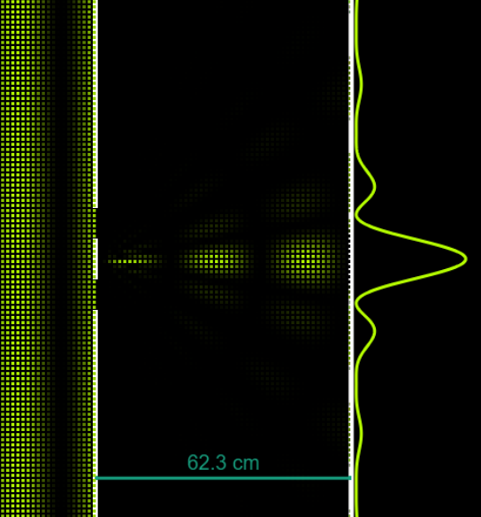

# Interference
 Lets find out more about interference here!

## History Of Interference
In Ancient times, the concept of wave interference was not well understood, but early observations of light patterns can be traced back to ancient civilizations. 

The understanding of interference began to take shape with the development of wave theory in the early 18th century, with the famous <b>Thomas Young's Double-Slit Experiment (1801)</b> showing the strange behaviours of light. While there were many mathematical approaches afterwards to calculate the interference patterns, it was only in the early 20th century that the concept of <b>particle wave duelity</b> slowly began to take shape. 

With that, more and more people started to accept the idea that small particles, such as the <b>Electron and Photons</b>, are able to exist in a superpositional state, both as a particle and a wave at the same time when unobserved.

### Young's double slit experiment
Thomas Young, an English scientist, conducted his famous double-slit experiment to demonstrate the wave nature of light.
In the experiment, Young directed light through two closely spaced slits onto a screen. 

Instead of producing two bright spots (as would be expected if light were a particle), he observed a pattern of alternating bright and dark fringes.

This result provided clear evidence of interference, where the light waves passing through the slits combined constructively (bright fringes) and destructively (dark fringes), confirming the wave theory of light. 

Young's experiment was pivotal in establishing that light behaves as a wave.

### Electron and Photon Waves
In the double-slit experiment with electrons, conducted by Clinton Davisson and Lester Germer, and later by others, electrons produced interference patterns similar to those observed with light. 

This provided evidence of wave-particle duality, where particles such as electrons exhibit both wave-like and particle-like properties.

Similar experiments with photons (light particles) have shown that even single photons can produce interference patterns when passed through a double slit, reinforcing the concept of wave-particle duality and the probabilistic nature of quantum mechanics.

## Differences from Diffraction:
Interference shares many similarities with diffraction. But if so what makes it different?
### Difference in Mechanism 
- Diffraction occurs when a <b>single</b> wave interacts with itself
- Interference occurs between <b>multiple</b> waves

### Difference in Formula

1. **Interference**  
    - Path Difference and Interference:  
    $\delta = r_2 - r_1$

    - Constructive Interference:  
    $\delta = m\lambda$

    - Destructive Interference:  
    $\delta = \left(m + \frac{1}{2}\right)\lambda$

    - Double-Slit Interference:
        1. Bright Fringes  
            - $d\sin\theta = m\lambda \quad$ 
            - $y_b = m\frac{L\lambda}{d}$ 

        2. Dark Fringes  
            - $d\sin\theta = \left(m + \frac{1}{2}\right)\lambda \quad$  
            - $y_d = \left(m + \frac{1}{2}\right)\frac{L\lambda}{d}$

2. **Diffraction**
    - Single-Slit Diffraction:
        - Minima: 
            1. $a\sin\theta = m\lambda, \quad m = \pm1, \pm2, \pm3, \dots \quad$
            2. Width of Central Maximum: $W = \frac{2L\lambda}{a}$

- Diffraction Grating:
    - Maxima: 
    $d\sin\theta = m\lambda \quad$

### Differece in Pattern
- **Diffraction**  

- **Interference**  

## Theory and Formulae:
[enrichment maybe whack trigo derivation?]

The <b>Principle of Superposition</b> states that when <b>TWO OR MORE</b> waves of the same kind overlap, the resultant displacement at any point at any instant is given by the <b>vector sum</b> of the <b>individual</b> displacements that each individual wave would cause at that point at that instant.

$y_{\text{resultant}} = y_1 + y_2 + y_3 + \dots + y_N$, where $y_{\text{resultant}}$ is the displacement of the resultant wave and $y_1, y_2, y_3 \dots, y_N$ are the individual displacements of the waves at the point of consideration 

Interference is the <b>superposing</b> of overlapping of <b>TWO OR MORE</b> waves to give a resultant wave whose displacement is given by the <b>Principle of Superposition</b>.

### Path Difference
Path difference ($\delta$) is the difference in the optical path lengths traveled by two waves from their respective sources to a specific point where interference is observed. It directly affects the phase relationship between the waves at that point.

Given two coherent sources $S_1$ and $S_2$, and a point of observation $P$, the path difference $\delta$ is expressed as:

$$ \delta = |S_1P - S_2P| $$

<canvas></canvas>

    <input type="range" min="50" max="200" step="10" value="120" class="slider" id="wavelengthInput">
    Wavelength: 120 px

    <input type="range" min="0.1" max="0.3" step="0.05" value="0.2" class="slider" id="amplitudeInput">
    Amplitude: 0.2

<input type="checkbox" id="lockScreen" checked="checked">
<label for="lockScreen">Lock Screen</label>
<input type="checkbox" id="lockPointer" checked="checked">
<label for="lockPointer">Lock Pointer</label>
 

Path Difference = 0λ
 
Phase Difference Δϕ = 0π
 
Constructive Interference!

### Phase Difference
Phase difference ($\Delta \phi$) between two waves at a point is the difference in their respective phases at that point. Mathematically, it's given by:

$$ \Delta \phi = \frac{2\pi}{\lambda} \cdot \delta $$

where $\lambda$ is the wavelength of the waves and $\delta$ is the path difference between the two waves.

<canvas></canvas>

    <input type="range" min="50" max="200" step="10" value="120" class="slider" id="wavelengthInput">
    Wavelength: 120 px

    <input type="range" min="0.1" max="0.3" step="0.05" value="0.2" class="slider" id="amplitudeInput">
    Amplitude: 0.2

<input type="checkbox" id="lockScreen" checked="checked">
<label for="lockScreen">Lock Screen</label>
<input type="checkbox" id="lockPointer" checked="checked">
<label for="lockPointer">Lock Pointer</label>
 

Path Difference = 0λ
 
Phase Difference Δϕ = 0π
 
Constructive Interference!

### Constructive Interference
<b>Constructive interference</b> occurs when the waves that meet are in phase at the point of consideration. 

Phase difference between the two waves at that point = $0, 2\pi, 4\pi, \dots$

This happens under the following conditions:  
If $\delta = m \cdot \lambda$ (where $m$ is an integer), then the waves arrive at the point <b>in phase</b>, reinforcing each other. This leads to <b>constructive interference</b> and results in a <b>maximum amplitude</b> at that point.

Resultant amplitude $A_R = A_1 + A_2$

### Destructive Interference

<b>Destructive interference</b> occurs when the waves that meet are in <b>in antiphase</b> (out of phase of difference 180 deg) at the point of consideration. 

Phase difference between the two waves at that point = $\pi, 3\pi, 5\pi$  

This occurs under the following condition:  
If $\delta = (m + \frac{1}{2}) \cdot \lambda$ (where $m$ is an integer), then the waves arrive <b>out of phase</b>, leading to cancellation of amplitudes. This results in <b>destructive interference</b> and a <b>minimum amplitude</b> (or even complete cancellation) at that point.

Resultant amplitude $A_R = A_1 - A_2$

### Order of Maxima and Minima
The order of maxima (bright fringes) and minima (dark fringes) in interference patterns depends on the path difference $\delta$:

- **Constructive Interference (Maxima)**: Occurs at points where the path difference $\delta$ corresponds to integer multiples of the wavelength $\lambda$,  
$\delta = m \cdot \lambda$.

- **Destructive Interference (Minima)**: Occurs at points where the path difference $\delta$ corresponds to half-integer multiples of the wavelength $\lambda$,  
$\delta = (m + \frac{1}{2}) \cdot \lambda$.

## Key Formulae Summary:
1. Wavelength  
$\lambda = 2\pi / k$,  
where $\lambda$ = wavelength and k is a constant

2. Path Difference  
$\delta = r_2 - r_1$,  
where $\delta$ is path difference and r is the length of path

3. Square of Longer Source  
$r_2^2 = r^2 + \left(\frac{d}{2}\right)^2 - 2r\left(\frac{d}{2}\right)\cos\left(\frac{\pi}{2} - \theta\right) = r^2 + \left(\frac{d}{2}\right)^2 + dr\sin\theta$,  
where d is the distance from source to screen

4. Square of Shorter Source  
$r_1^2 = r^2 + \left(\frac{d}{2}\right)^2 - 2r\left(\frac{d}{2}\right)\cos\left(\frac{\pi}{2} + \theta\right) = r^2 + \left(\frac{d}{2}\right)^2 - dr\sin\theta$

5. Derivation from 3 - 4  
$(r_2 - r_1)(r_2 + r_1) = 2dr\sin\theta$

6. Small distance approximation  
$\delta = r_2 - r_1 \approx d\sin\theta$

7. Condition for constructive interference  
$d\sin\theta = m\lambda, \quad m = 0, \pm1, \pm2, \pm3, \ldots \text{ (constructive interference)}$

8. Condition for destructive interference  
$d\sin\theta = \left(m + \frac{1}{2}\right)\lambda, \quad m = 0, \pm1, \pm2, \pm3, \ldots \text{ (destructive interference)}$

9. Small Angle Approximation  
$\sin\theta \approx \tan\theta = \frac{y}{L}$

10. Finding the distance to the bright spots  
$y_b = m\frac{L\lambda}{d}$

11. Finding the distance to the dark spots  
$y_d = \left(m + \frac{1}{2}\right)\frac{L\lambda}{d}$
